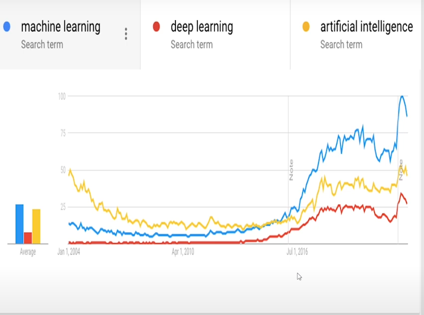

# Machine Learning Foundation

Before starting, it's essential to have prerequisite knowledge in the following topics from mathematics and statistics:

- **Differentiability and Derivatives**
- **Critical Points**: Local maxima and minima
- **Linear Algebra**: Vectors, determinants, linear equations, matrices
- **Dimensions, Rank, and Null Space**
- **Derivatives and Directional Derivatives**

## Week 1: Introduction to Machine Learning

In this first week, we will cover the basics of machine learning, including important terms and concepts. Understanding how functions work in machine learning is essential.

### Topic 1: What is a Regression Model?

A regression model takes a set of input values and produces an output, usually in the form of a label. The model learns how to process the input data to provide the corresponding output accurately.

Today, we use machine learning to equip tools with sufficient data and algorithms, allowing them to convert inputs into outputs effectively.

### Example: Password Verification

Consider a simple task like checking a password. When someone types in their password, it is sent to the server, which checks if the password matches any stored records. If it does, access is granted.

At the programming level, humans create tools to handle data. In machine learning, instead of giving detailed instructions, humans provide general guidelines. The machine learns how to perform tasks based on those instructions.

### Machine Learning Algorithm Overview

In a machine learning algorithm, the process can be summarized as follows:

1. **Input**: The data we provide.
2. **Software**: The machine learning model (like the regression model) processes the data.
3. **Output**: The result or prediction that comes from the model.
4. **Tools**: The tools have a set of data on which the machine learning algorithm will work to provide the output.

In essence, when humans create a regression model, they are building software that uses specific formulas to analyze the data and generate results.

Tasks that involve large amounts of data and require substantial effort can often be performed more efficiently by machine learning. There are many examples where humans are ultimately incapable of doing what machines can do.

## Concepts Covered

1. **Popularity of Machine Learning**  
   

2. **Important Data Types for Model Training**  
   Understanding complex data types is crucial. Humans naturally interpret complicated data, like speech, while machines can learn to do so as well. Text data also plays a key role in semantic understanding.

3. **Different Domains/Verticals Where Machine Learning is Used**  
   Machine learning has applications across various sectors, enhancing decision-making and automation.

4. **What is and is Not Machine Learning**  
   - **Not**: Procedural, memorized, or magical.
   - **Is**: Data-driven, generalized (learning to perform well with unseen data), based on mathematical principles.

5. **Concrete Examples of Machine Learning Problems**  
   Real-world scenarios that illustrate the effectiveness of machine learning solutions.

## Important Types of Data in Machine Learning Models

- [ ] Text
- [ ] Speech
- [ ] Vision

